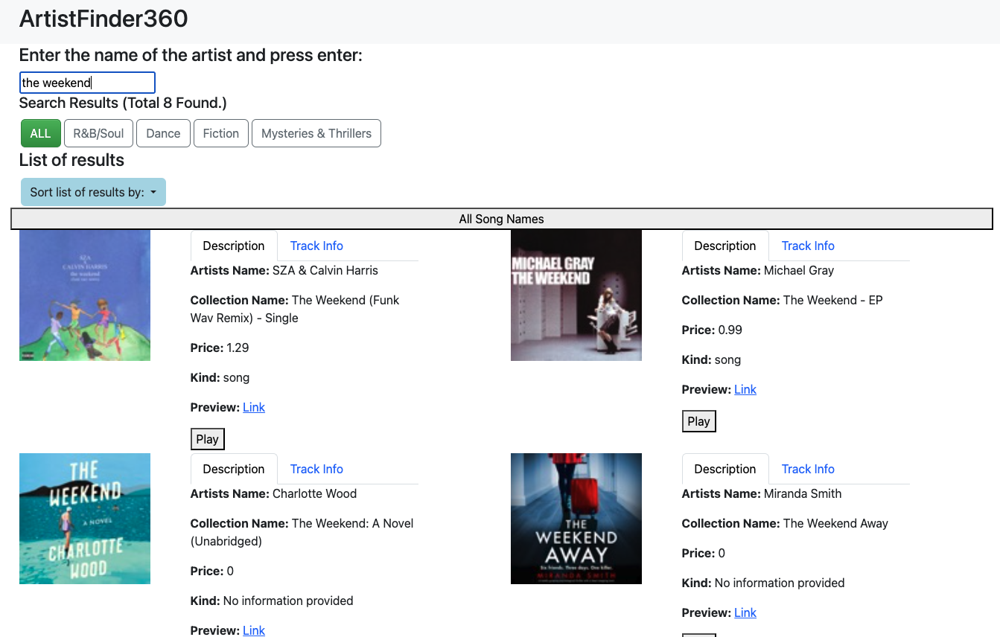

# ArtistFinder360

## Project Description
**ArtistFinder360** is a responsive, interactive artist search engine developed using Vue.js and Bootstrap. It demonstrates the application of the Model-View-Controller (MVC) architectural pattern to create a dynamic, user-friendly interface that allows users to search and retrieve artist data efficiently.



## Technologies Used
- **Vue.js**: Utilized for creating a reactive, component-driven user interface.
- **Bootstrap**: Employed to ensure the application is responsive and accessible across a variety of devices.
- **MVC Pattern**: Implemented to structure the application logically, separating concerns and enhancing maintainability.

## Features
- **Dynamic Search Functionality**: Allows users to perform real-time searches and display relevant artist data.
- **Responsive Web Design**: Ensures that the application is functional and aesthetically pleasing on desktops, tablets, and smartphones.
- **Intuitive User Interface**: Provides a clean and straightforward user experience with easy navigation and interaction.

## Installation
To run **ArtistFinder360** locally:
1. Clone the repository to your local machine:
   ```bash
   git clone https://github.com/yourusername/artistFinder360.git

2. Navigate to the project directory:
   ```bash
   cd artistFinder360

3. Open `index.html` in your browser:
   ```bash
   open index.html

## Usage
Simply open the `index.html` file in a modern web browser to start exploring the ArtistFinder360. Use the search bar to look up artists and view detailed information about their works and profiles.

## Acknowledgments
Special thanks to University of Michigan and the professors for providing the resources and environment to develop this application.